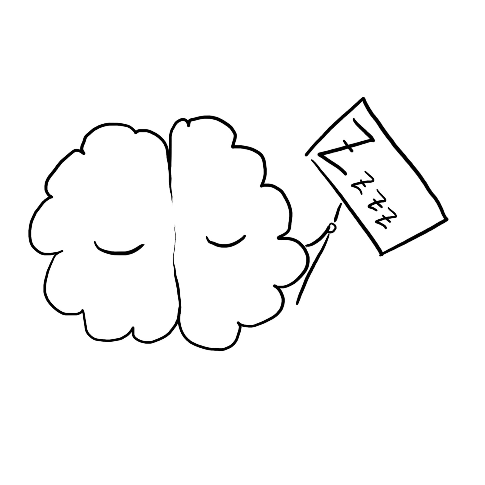
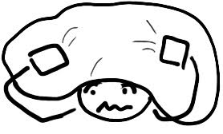
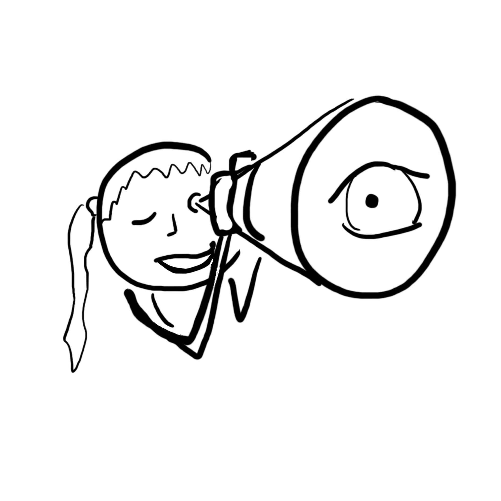
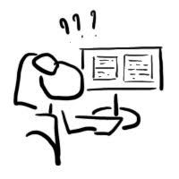

# Starting Blogging

Hello there o/

We are on the morrow of [Heart of Clojure 2024] and I might
have been influenced into starting up a blog

... or whatever this will turn out to be\

So, why? Why am I starting a blog?

The opening talk of that 2-days conference was titled "[What it means to be open]" by [Lu Wilson] and although the story starts by "the internet is
full of mean people", it ends with "putting yourself out there is worth your
while and being scared". And so, why not give it a try?

(yes I am widely summarising this talk, sorry not sorry

)

Approximately 32 hours later, during the lightning talks, someone (I knew I
should have taken a picture of who was speaking then!) put forward another good
point or two about blogging. It took a little bit of help, for my
2-days-over-clocking-brain-in-recovery to remember.\
\
The main point was that writing down your ideas
forces you to organise them properly. And also, when in shame, blog more.

This last is fun to write, but I am sure it will be hard to do\

<-- me anticipating hidding under the duvet

Finally, something else has stuck with me from before the conference,
something [Gary] said to me about his time blogging: because he was writing
every week, he was on the lookout for interesting things to research
and share.\
(by the way, [Gary's blog] is [here][Gary's blog])\
This sounds fun and interesting and learning and so I want to try and
be on the look-out for topics to write and share about.\

Sooooo, I am starting this journey.\
I am not yet sure what this blog will contain. I hope a bit of serious or
not-so-serious technical stuff, maybe some fun moments, probably some rantings
or rambling ... we will see?

Let's add a dash of full honesty here: I am starting a blog with the hope
to link with a community, to be part and contribute to this community.
Looking at my motivations, behing all the discovery, organising ideas, sharing,
the social aspect is at the top. I am a strongly social person, I like to chat
, I am easily influenced by those around me (I had to learn to pick carefully)
and I care way too much for what others think, I am hoping for positive
feedbacks and I am deeply scared of all _this_.

So, for my future self who will probably wonder why I ever started blogging:
- because it's fun
- to learn and discover
- to meet and contribute to the community

I hope you will have fun reading

Now ... how do I put this online?\

[Heart of Clojure 2024]: https://2024.heartofclojure.eu/
[Lu Wilson]: https://www.todepond.com/
[What it means to be open]: https://2024.heartofclojure.eu/talks/what-it-means-to-be-open/
[Gary]: https://github.com/gaverhae
[Gary's blog]: https://cuddly-octo-palm-tree.com/
